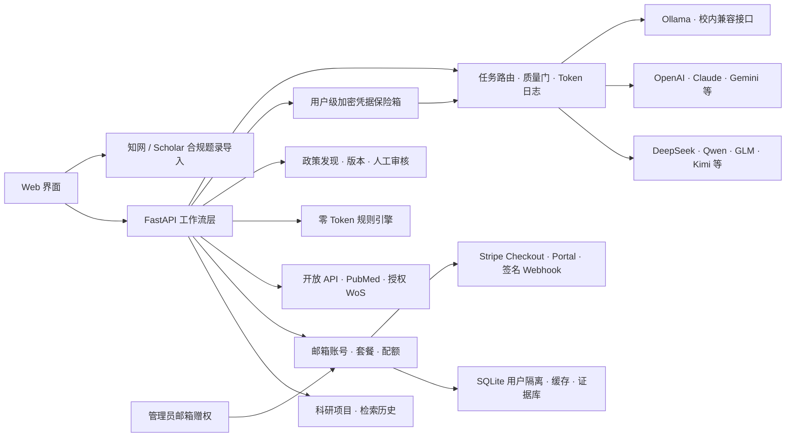

# LatticeScholar

> 当前版本：v0.9.1。围绕一个课题，把双语检索、论文精读、页码证据、政策背景、多模型研讨和下一步行动留在同一条可复查路径中。

[](https://github.com/CBarran498/LatticeScholar/actions/workflows/ci.yml)
[](https://www.python.org/)
[](LICENSE)

> 开源、证据驱动的科研智能工作台：多平台文献检索、论文解剖、期刊匹配、全行业政策雷达，以及可证伪科研 Idea。

LatticeScholar 面向高校教师、博士后、研究生和科研管理人员。它不以一句"AI 总结"替代科研判断，而是把论文元数据、证据片段、团队已有能力与官方战略信号组织为可核验的工作流。

## 产品原则

- 证据可回溯：保留 DOI、来源、发布日期、原文链接与证据片段；
- 缺失要明示：不补写数据库或论文没有提供的结论、指标与"创新"；
- 假设可证伪：Idea 必须包含风险、反证条件和第一轮验证；
- 轻量优先：不配置 LLM 也能完成检索、去重、缓存、规则分析和结构化 Idea；
- 合规接入：不绕过付费墙，不自动抓取 Google Scholar 或知网受限内容。

## 已实现能力

| 工作流 | 已实现能力 | 防误导设计 |
|---|---|---|
| 科研项目 | 以研究问题为核心管理检索轨迹、证据数量、项目状态与当前上下文 | 删除项目容器不删除证据；不同账号严格隔离 |
| 文献雷达 | Crossref、Semantic Scholar、arXiv、OpenAlex、PubMed；授权后接入 Web of Science；知网/Google Scholar 题录导入 | 展示来源状态、授权路径和元数据缺失 |
| 论文解剖 | 摘要或本地 PDF；多栏版面重排、可选本机 OCR、四问速读、逐页证据与固定中文解释 | 显示提取质量；原文引文不翻译；未披露内容保持缺失；PDF 仅在内存解析 |
| 期刊匹配 | 用真实相关论文样本聚合候选期刊与 DOI 证据 | 不预测录用率，不伪造影响因子或审稿周期 |
| 政策雷达 | 人工核验政策快照 + 32 个跨行业官方政策源 + 增量候选发现 | 自动发现不自动发布；发布方、日期、官方链接和版本完整保留 |
| Idea Lab | 可手动输入，也可上传 PDF、Word、PPT、Excel、ODT、Markdown、LaTeX、Jupyter、BibTeX、RIS 等已有工作；结合文献边界与政策信号输出假设、风险和首轮验证 | 本地提取、明示预览与长度上限；不声称已完成查新或证明新颖性 |
| 科研研讨室 | 由智能路由选择已连接模型，围绕当前课题、证据库和已选政策讨论研究问题、缺口、实验、组会与写作 | 只能引用真实证据编号；结论、不确定性和本周行动分开 |
| 个人证据库 | 多用户隔离的 SQLite 收藏、项目归档、Markdown/BibTeX/RIS 导出 | 数据格式可迁移，账号间相互隔离 |
| 模型控制台 | 连接 16 类国内外、聚合与本地模型服务；按任务选择快速/深度模型，显示 Token、耗时与备用路由 | BYOK 密钥在服务端加密保存且不回显；只在临时故障时切换；用量日志不保存论文正文 |
| 检索质量审计 | 每轮显示成功数据源、摘要/DOI 覆盖、多源印证、重复合并与综合可信度 | 明确声明这是元数据质量指标，不是论文质量、创新性或可信结论 |

## 开源与收费如何同时成立

项目采用"开源社区版 + 官方托管服务"的开放核心模式：

| 版本 | 费用 | 适合人群 | 权益 |
|---|---:|---|---|
| Community | 免费 | 愿意自行部署的个人/课题组 | Apache-2.0 源码；全部本地工作流；自行提供接口、模型与运维 |
| Free Hosted | 长期免费 | 希望打开网址直接使用的个人 | 基础数据源、零 Token 分析和每日免费额度 |
| Pro Hosted | 建议早鸟价 ¥15/月 | 高频使用或需要高级能力的个人 | 全部托管数据源、深度模型、批量题录导入、更高额度和优先支持 |
| Complimentary | 免费 | 共创用户、合作课题组、公益名额 | 管理员按邮箱赠送全部 Pro 权益，可永久或限时 |

收费对象是官方托管服务产生的算力、模型 Token、商业接口、同步、运维与支持成本，而不是人为阉割 GitHub 社区版。更完整的定价、成本边界、转化路径与上线阶段见 [商业化设计](docs/MONETIZATION.md)。

## 免安装桌面版（推荐普通用户）

不需要安装 Python，不需要命令行。从 [GitHub Releases](https://github.com/CBarran498/LatticeScholar/releases) 下载对应平台的压缩包，解压后双击运行：

| 平台 | 下载文件 | 启动方式 |
|---|---|---|
| macOS (Apple Silicon M1/M2/M3/M4) | `LatticeScholar-macos-arm64.tar.gz` | 解压后双击 `LatticeScholar` |
| Windows 10/11 (64 位) | `LatticeScholar-windows-x64.zip` | 解压后双击 `LatticeScholar.exe` |
| Linux x64 (Ubuntu 22.04+/Debian 12+) | `LatticeScholar-linux-x64.tar.gz` | 解压后运行 `./LatticeScholar` |

浏览器会自动打开 [http://127.0.0.1:8765](http://127.0.0.1:8765)。首次启动会看到邮箱登录页——输入邮箱后验证码直接显示在页面上，无需额外配置。数据保存在用户主目录的 `.latticescholar` 文件夹中。

> **macOS Intel 用户**：下载 ARM64 版本即可，macOS 会通过 Rosetta 2 自动翻译运行，无需额外操作。
>
> **macOS 首次打开**如果提示"无法验证开发者"：右键 → 打开 → 确认；或在终端执行 `xattr -cr LatticeScholar/`。
>
> **Windows** 首次打开如果提示"Windows 已保护你的电脑"（SmartScreen）：点击"更多信息" → "仍要运行"。建议将文件解压到不含中文和空格的路径（如 `D:\LatticeScholar\`）。
>
> **桌面版不支持的环境**（Windows 7/8、32 位系统、Linux ARM64、旧版 Linux 等）请使用[从源码启动](#从源码启动开发者与课题组)，只需 Python 3.9+。

完整安装指南见 [本地安装与使用完整指南](docs/LOCAL_SETUP.md)。

## 从源码启动（开发者与课题组）

需要 Python 3.9 或更高版本：

```bash
git clone https://github.com/CBarran498/LatticeScholar.git
cd LatticeScholar
python3 -m venv .venv
source .venv/bin/activate
pip install -e .
latticescholar
```

打开 [http://127.0.0.1:8765](http://127.0.0.1:8765)。首次启动会看到邮箱登录页，输入邮箱后验证码会直接显示在页面上（本地未配置 SMTP 时自动启用开发模式）。第一个用 `LATTICE_ADMIN_EMAILS` 中邮箱登录的用户为管理员（Pro 权益），其他用户默认 Free（7 天试用 Pro）。

Windows PowerShell：

```powershell
py -m venv .venv
.venv\Scripts\Activate.ps1
pip install -e .
latticescholar
```

## 邮箱登录、试用和管理员赠权

默认即为邮箱登录模式（`LATTICE_AUTH_MODE=accounts`）。本地未配置 SMTP 时，验证码会直接显示在登录页（开发模式自动启用），无需手动设置任何环境变量。

建议在 `.env` 中设置管理员邮箱，以获得 Pro 权益和管理功能：

```bash
LATTICE_ADMIN_EMAILS=owner@example.edu
```

公网部署时需配置 SMTP，验证码将通过真实邮件发送，开发模式自动关闭。管理员用 `LATTICE_ADMIN_EMAILS` 中的邮箱登录后，侧栏会出现"系统管理"，可输入任意规范邮箱并赠送永久或限时 Pro 权益，也可核验自动发现的政策候选。用户完成邮箱验证码登录后自动生效。

如需恢复无登录模式，设置 `LATTICE_AUTH_MODE=open` 即可。

发布 GitHub 仓库后设置 `LATTICE_REPOSITORY_URL=https://github.com/你的账号/latticescholar`，账户页会显示正确的开源仓库入口。

可用 `LATTICE_EARLY_ACCESS_UNTIL=2026-12-31T23:59:59+08:00` 让截止日期前的全部注册用户免费使用全功能，适合冷启动阶段。

## Stripe 订阅

```bash
export LATTICE_BILLING_ENABLED=true
export LATTICE_BILLING_PROVIDER=stripe
export LATTICE_PUBLIC_BASE_URL=https://research.example.com
export STRIPE_SECRET_KEY=sk_live_xxx
export STRIPE_PRO_PRICE_ID=price_xxx
export STRIPE_WEBHOOK_SECRET=whsec_xxx
```

Webhook 地址为 `https://你的域名/api/billing/webhook/stripe`。应用会核验原始请求体签名、拒绝超过五分钟的事件并按事件 ID 幂等处理。价格以 Stripe Price 对象为准；界面中的 ¥15 是早鸟定价建议，不会替代支付后台金额。

完整生产环境变量与 HTTPS 部署见 [托管部署方案](docs/PRIVATE_DEPLOYMENT.md)。

## 多模型 AI 是可选增强

侧栏"模型控制台"可以直接连接以下服务，无需改代码：

- 国内：DeepSeek、通义千问、智谱 GLM、Kimi、MiniMax、腾讯混元、豆包/火山方舟、百度千帆；
- 国际：OpenAI、Anthropic Claude、Google Gemini、Mistral、Cohere、xAI Grok；
- 聚合与本地：OpenRouter、Ollama/校内 OpenAI-compatible 网关。

用户输入 API Key 后，浏览器只把它提交一次。服务端使用 Fernet 对称加密保存，并且之后所有读取接口只返回末四位。均衡路由默认让检索式等轻任务使用快速模型，让论文解剖、Idea Lab 和课题研讨使用深度模型；不会默认同时调用多家服务。备用切换只处理超时、限流和服务端临时错误，鉴权、余额、内容结构错误会直接报告，避免不透明的重复扣费。

模型与区域地址会更新，界面允许修改快速/深度模型 ID 和部分平台的 Base URL。请以自己账号控制台当前可用模型为准。完整支持矩阵、安全边界和故障排查见 [多模型接入与 BYOK 安全指南](docs/MODEL_PROVIDERS.md)。

无模型时，基础规则能力的云 Token 消耗为 0。本地 Ollama：

```bash
export LATTICE_LLM_PROVIDER=ollama
export LATTICE_LLM_BASE_URL=http://127.0.0.1:11434
export LATTICE_LLM_MODEL=qwen2.5:7b
```

OpenAI-compatible 接口需要显式允许远程发送文本：

```bash
export LATTICE_LLM_PROVIDER=openai_compatible
export LATTICE_LLM_BASE_URL=https://your-provider.example
export LATTICE_LLM_API_KEY=your-key
export LATTICE_LLM_MODEL=your-model
export LATTICE_ALLOW_REMOTE_LLM=true
```

上面的环境变量方式仍用于无人值守部署和向后兼容；普通本机用户优先使用模型控制台。不要提交密级材料、未公开专利内容、受限数据或可识别个人信息。

### DeepSeek 推荐配置

DeepSeek 不是一个孤立聊天框，而是按任务嵌入三条工作流：Flash 负责高频的中英文检索式生成，Pro 负责论文深度解剖、Idea Lab 和项目证据研讨。`balanced` 是默认路由；希望最低成本可用 `economy`，希望全部使用推理模型可用 `quality`。

```bash
export LATTICE_LLM_PROVIDER=deepseek
export DEEPSEEK_API_KEY=sk-your-key
export LATTICE_ALLOW_REMOTE_LLM=true
export LATTICE_DEEPSEEK_ROUTING=balanced
latticescholar
```

打开侧栏"模型控制台"检查服务端配置并执行最小连接测试。环境变量密钥不写入数据库；网页 BYOK 密钥只以加密密文写入 SQLite，明文不会通过读取接口返回。模型调用只记录模型名、任务、输入/输出/缓存/推理 Token 与耗时，不记录论文正文、研究问题或回答内容。

可选参数：

```bash
export LATTICE_DEEPSEEK_FAST_MODEL=deepseek-v4-flash
export LATTICE_DEEPSEEK_REASONING_MODEL=deepseek-v4-pro
export LATTICE_DEEPSEEK_THINKING=adaptive
export LATTICE_DEEPSEEK_REASONING_EFFORT=high
```

完整的任务路由、请求协议、重试、隐私边界、费用控制与故障排查见 [DeepSeek 集成指南](docs/DEEPSEEK_INTEGRATION.md)。模型名称、能力和价格可能变化，发布或部署前应核对 DeepSeek 官方文档；项目不会用硬编码价格作为用户账单依据。

## PDF 解析与中文回答

默认 `core` 引擎使用宽松许可的 PDFPlumber 进行按页文字、坐标与多栏重排，并用 pypdf 兼容兜底。它适合带文字层的论文 PDF，不会把 AGPL 组件隐式带入 Apache-2.0 核心安装。扫描件应先用学校授权软件或可信本机工具完成 OCR；公式、复杂表格、图中数值和版面顺序仍须回原文核验。

需要 PyMuPDF4LLM 版面流、PyMuPDF 文字块和本机 Tesseract OCR 时，可显式安装高级引擎：

```bash
pip install -e ".[advanced-pdf]"
export LATTICE_PDF_ENGINE=pymupdf
```

`advanced-pdf` 中的 PyMuPDF/PyMuPDF4LLM 采用 AGPL 或 Artifex 商业许可，并非本项目 Apache-2.0 许可的一部分。特别是公网托管、闭源修改或商业使用前，请自行确认当前许可义务或取得商业许可；详见 [第三方许可说明](THIRD_PARTY_NOTICES.md)。

无论原文是中文还是英文，解释、判断和核验提醒都固定使用简体中文。为保持可追溯性，直接证据引文保留论文原始语言并标注页码；这不是"中文输出失败"，而是避免把机器翻译伪装成原文。

结果页只回答四个问题：领域痛点、相对经典工作的改动、实验是否充分、必须回原文深挖之处。每问采用"一句结论 + 分条详答 + 页码位置"，不再重复展示方法、创新、发现和局限长面板；原文引文默认折叠，提交后答案自动切换为全宽阅读。

## 数据源配置

```bash
export CROSSREF_EMAIL=you@university.edu
export SEMANTIC_SCHOLAR_API_KEY=optional-key
export OPENALEX_API_KEY=optional-key
export NCBI_EMAIL=you@university.edu
export NCBI_API_KEY=optional-key
export WOS_API_KEY=clarivate-key
```

Google Scholar 没有供本项目使用的官方批量 API；知网数据受机构订阅与授权约束。因此二者通过原站检索和 BibTeX/RIS/EndNote/NBIB 题录导入进入统一证据层，不进行网页抓取。详见 [数据源与合规](docs/DATA_SOURCES.md)。

## 政策自动发现与审核

自托管服务可每天发现官方门户中的政策候选：

```bash
export LATTICE_POLICY_SYNC_INTERVAL_HOURS=24
export LATTICE_POLICY_SYNC_SOURCE_IDS=state-council,most,nsfc,moe
```

发现结果必须由管理员在"系统管理"中核验后才会发布。也可运行 `python scripts/sync_policies.py --source state-council` 手动同步。完整运行方式、审核清单和 GitHub 更新流程见 [项目更新与政策运营手册](docs/MAINTENANCE.md)。

## 架构



## 开发与验证

```bash
pip install -e ".[dev]"
ruff check .
pytest -q
```

项目包含账号登录、免费额度、Pro 功能门控、管理员赠权、科研项目隔离、检索留痕、政策审核生命周期、题录导出，以及 Stripe Webhook 签名与幂等测试。在线数据源烟雾测试可运行 `python scripts/smoke_online.py`。

## 文档

- [本地安装与使用完整指南](docs/LOCAL_SETUP.md)
- [商业化设计](docs/MONETIZATION.md)
- [多模型接入与 BYOK 安全指南](docs/MODEL_PROVIDERS.md)
- [产品分析与路线图](docs/PRODUCT.md)
- [全面产品审计](docs/PRODUCT_AUDIT.md)
- [0.6 产品与科研体验审计](docs/PRODUCT_AUDIT_0.6.md)
- [0.7 DeepSeek 与科研研讨审计](docs/PRODUCT_AUDIT_0.7.md)
- [DeepSeek 集成指南](docs/DEEPSEEK_INTEGRATION.md)
- [面向科研用户的使用指南](docs/USER_GUIDE.md)
- [0.5 PDF 与科研体验专项审计](docs/PRODUCT_AUDIT_0.5.md)
- [GitHub 开源发布操作手册](docs/OPEN_SOURCE_RELEASE.md)
- [发布前审计报告](docs/RELEASE_AUDIT.md)
- [第三方许可说明](THIRD_PARTY_NOTICES.md)
- [系统架构](docs/ARCHITECTURE.md)
- [数据源与合规](docs/DATA_SOURCES.md)
- [隐私与安全](docs/PRIVACY.md)
- [托管部署方案](docs/PRIVATE_DEPLOYMENT.md)
- [本地验证报告](docs/VALIDATION.md)
- [项目更新与政策运营手册](docs/MAINTENANCE.md)
- [参与贡献](CONTRIBUTING.md)

## License

代码采用 [Apache License 2.0](LICENSE)。这允许个人和机构使用、修改、分发及商业化，但必须遵守许可证中的通知与归属要求。第三方学术元数据、摘要、论文、政策原文、商标和商业数据库内容仍受各自许可、版权与使用条款约束。
