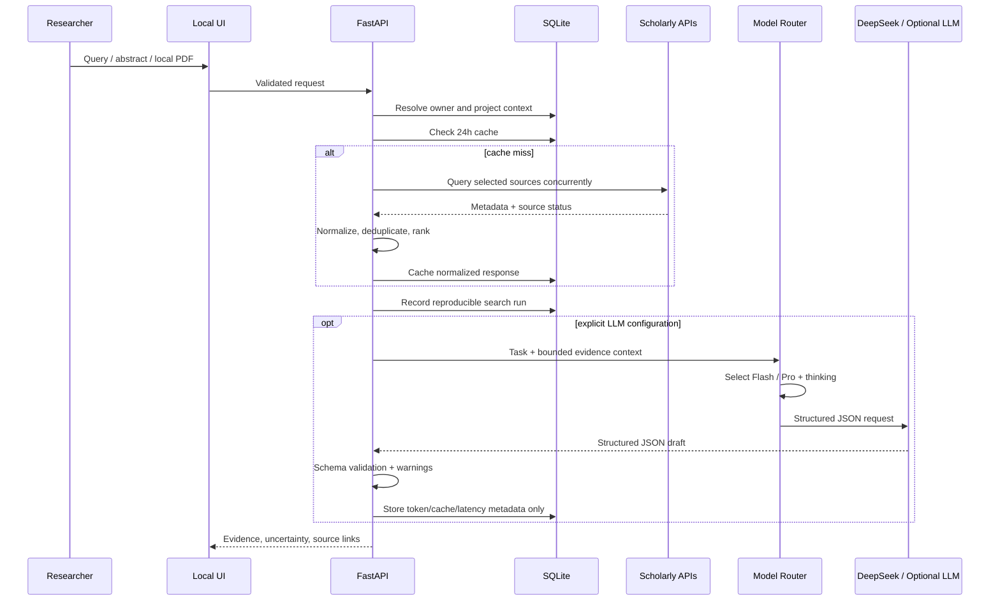

# 系统架构

## 组件

- `src/latticescholar/main.py`：本地 API、校验、上传限制与静态界面；
- `services/sources.py`：Crossref、Semantic Scholar、OpenAlex、arXiv、PubMed 与授权 Web of Science 适配；
- `services/importer.py`：知网、Google Scholar 等平台导出的 BibTeX/RIS/EndNote/NBIB 题录解析；
- `services/auth.py`：HMAC 会话签名与校验；
- `services/accounts.py`：邮箱验证码、用户会话、管理员/用户角色判定；
- `services/literature.py`：并发结果的缓存、去重、合并与排序；
- `services/pdf_parser.py`：默认 PDFPlumber 文字层、双栏顺序、页眉页脚与提取质量；可选高级引擎负责 PyMuPDF/OCR 路径；
- `services/analyzer.py`：固定中文的零 Token 四问分析、证据窗口与可选模型深度分析；
- `services/journals.py`：基于相关论文样本的可解释期刊聚合；
- `services/policies.py`：官方政策快照、主题检索与全行业主管部门来源目录；
- `services/policy_sync.py`：官方门户候选发现、同域限制、内容哈希、同步记录与审核队列；
- `services/ideas.py`：证据三角、假设、风险和最小验证；
- `services/llm.py`：Ollama、OpenAI-compatible 与 DeepSeek 协议；DeepSeek 任务路由、thinking、重试、结构化 JSON 和用量元数据；
- `services/research_assistant.py`：双语检索式与当前项目证据约束科研研讨；
- `services/exporter.py`：Markdown、BibTeX 与 RIS 可迁移导出；
- `services/updates.py`：带缓存的 GitHub Release 版本检查；
- `db.py`：SQLite WAL 缓存、科研项目、检索历史、政策版本、用户隔离证据库、赠权、订阅、模型用量元数据与 Webhook 幂等；
- `static/`：无 Node.js 构建链的响应式界面。

## 数据流

## 性能策略

- 仅使用异步网络 I/O；单个来源失败不会阻断其他来源；
- 查询缓存键包含检索词、来源、年份和数量，默认 TTL 为 24 小时；
- 单源结果上限 100，UI 默认总结果 20；
- DOI 优先去重，无 DOI 时使用规范化标题；
- LLM 输入默认截断到 14,000 字符，输出上限 1,400 Token；
- DeepSeek 默认让 Flash 处理检索式，让 Pro 处理论文、Idea 和课题研讨；失败只做有限重试；
- 科研研讨最多使用当前项目 12 条有限证据，虚构证据编号会在服务端剔除；
- PDF 限制 15 MB、40 页、60,000 字符，只在内存中解析；
- 前端为静态文件，无运行时编译、Node.js 或前端依赖树。

## 排序与分数

检索分数由主题词余弦相似度、对数引用信号、时效与多源印证组成。期刊分数由主题匹配、相关论文样本量、样本时效与引用信号组成。

这些权重用于排序体验，不是科研质量模型。跨学科比较、引用覆盖差异和出版时间偏差会影响结果，因此界面始终展示分项证据和警告。

## 扩展方式

新增论文源需要返回统一 `Paper` 模型并在 `ScholarlySources.search` 注册。新增政策源需要先进入 `PolicySource` 官方门户目录；发现记录必须经过候选队列和人工审核，包含唯一 ID、标题、发布方、发布日期、官方 URL、摘要、信号和标签后才能发布。科研项目只是上下文容器，删除时解除 `library_items` 与 `search_runs` 的关联，不级联删除用户证据。
