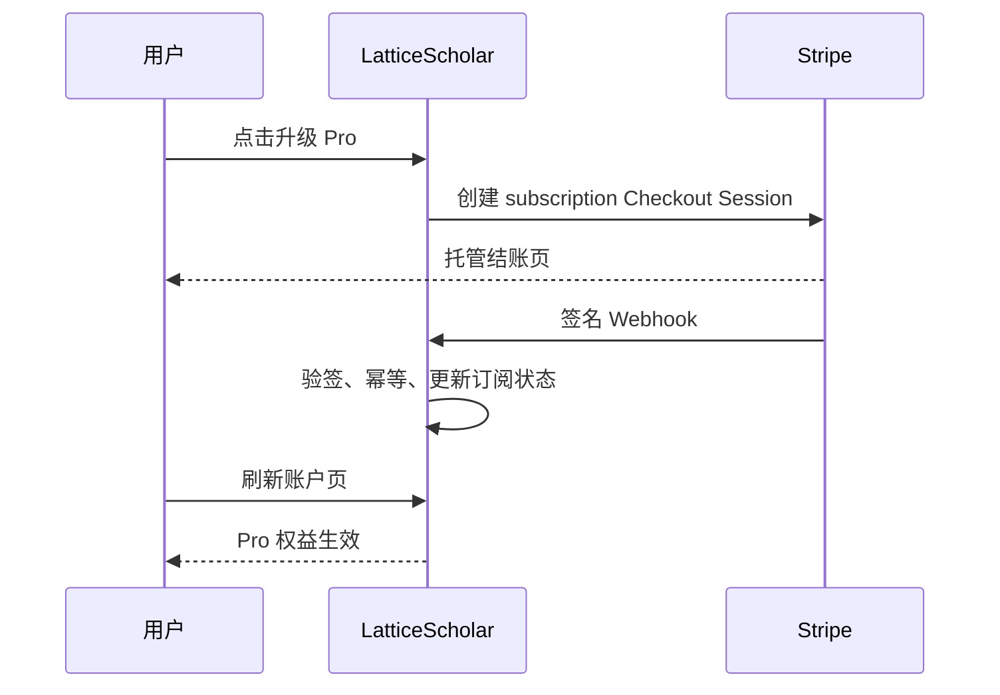

# LatticeScholar 商业化与权益设计

## 1. 推荐结论

采用“Apache-2.0 开源社区版 + 官方托管 Freemium”的模式。社区版提供完整、可信的本地科研工作流；官方服务通过免部署、托管模型、商业数据源、同步、协作、稳定性和支持收费。

这样既能保留 GitHub 增长所需要的低门槛、可验证和可贡献性，也能把收入与真实的持续成本绑定，避免用户认为项目“先开源、后锁功能”。

## 2. 权益矩阵

| 能力 | Community 自托管 | Free Hosted | Pro Hosted | 管理员赠送 |
|---|---|---|---|---|
| 本地规则工作流 | 全部 | 每日额度 | 不限或高额度 | 同 Pro |
| Crossref / arXiv / PubMed | 自备网络与 Key | 支持 | 支持 | 支持 |
| Semantic Scholar / OpenAlex / WoS | 自备 Key/授权 | 不含 | 支持，仍受来源授权 | 同 Pro |
| BibTeX / RIS / NBIB 批量导入 | 支持 | 不含 | 支持 | 支持 |
| 深度模型分析 / 高级 Idea Lab | 自备模型与成本 | 不含 | 含合理用量 | 支持 |
| 证据库 | 本地自主管理 | 50 条起 | 更大或不限 | 同 Pro |
| 官方运维、备份、更新 | 自行负责 | 包含 | 包含 | 包含 |
| 优先支持 | 社区渠道 | 社区渠道 | 优先 | 按赠送政策 |

“不限”应在用户协议中定义为合理使用，并保留反滥用、公平调度和异常流量限速条款；不要承诺不可持续的绝对无限 Token。

## 3. 建议价格与阶段

### 阶段 A：前 30–60 天，共创冷启动

- 设置 `LATTICE_EARLY_ACCESS_UNTIL`，所有完成邮箱验证的用户临时获得 Pro；
- 招募 50–200 名跨学科高校用户，重点观察次周留存、每次任务成本和真实高频工作流；
- 不急于收费，先验证用户是否持续回访、是否愿意导入证据和复用结果。

### 阶段 B：免费版 + 7 天 Pro 试用

- Free 长期存在，不要求绑卡；
- 新用户 7 天 Pro 试用，由 `LATTICE_TRIAL_DAYS=7` 控制；
- Pro 建议早鸟价 ¥15/月或 ¥149/年。正式定价前先以实际模型/API/存储成本校准；
- 给早期共创者、合作课题组、学生公益计划按邮箱赠送永久或限时权益。

### 阶段 C：团队与机构版

个人 Pro 有稳定续费后再做团队功能。团队版可以为共享课题空间、成员权限、统一账单、机构模型网关、审计和专属部署收费，避免过早承担销售与交付成本。

## 4. 免费额度默认值

| 指标 | 默认值 | 环境变量 |
|---|---:|---|
| 文献检索 | 20 次/日 | `LATTICE_FREE_SEARCHES_PER_DAY` |
| 论文分析 | 5 次/日 | `LATTICE_FREE_ANALYSES_PER_DAY` |
| 期刊匹配 | 3 次/日 | `LATTICE_FREE_JOURNAL_MATCHES_PER_DAY` |
| Idea Lab | 1 次/日 | `LATTICE_FREE_IDEAS_PER_DAY` |
| 证据库 | 50 条 | `LATTICE_FREE_LIBRARY_ITEMS` |

这些值是产品起点而非永恒规则。上线后用“任务完成率、次周留存、升级点击率、付费转化率、退款率、单个活跃用户边际成本”共同校准。不要只追求转化而破坏 Free 的独立使用价值。

## 5. 权益判定优先级

系统按以下顺序计算用户权益：

1. 自托管社区模式：全部本地能力；
2. 管理员账号：全部能力；
3. 有效的邮箱赠送权益；
4. 有效或试用中的付费订阅；
5. 全站早期免费期；
6. 新用户 Pro 试用；
7. 长期 Free。

邮箱先经过验证码验证，再用于管理员赠权匹配。赠送记录支持永久有效或 ISO 8601 到期时间；管理员重复输入同一邮箱会更新记录，也可随时撤销。

## 6. 支付与状态同步

当前实现 Stripe Checkout、Customer Portal 和签名 Webhook：

- 结账价以服务端配置的 Stripe Price ID 为准；
- Webhook 使用原始请求体、`Stripe-Signature` 和密钥验签；
- 事件时间戳容差为五分钟，并按事件 ID 防止重复处理；
- Customer Portal 用于取消、续订、付款方式和账单管理；
- 国内个人用户支付可在后续增加支付宝/微信支付适配器，但不要让业务权限逻辑依赖某一家支付平台。

## 7. 成本与 Token 控制

- 检索结果默认缓存 24 小时，重复任务优先命中缓存；
- 规则模式不调用模型，永远保留为免费回退；
- 深度分析限制输入字符和最大输出 Token，避免整本 PDF 无边界发送；
- 高成本来源和模型只有在 Pro 权益且用户明确选择时调用；
- 用量按“完成一次用户任务”计数，比单纯展示 Token 更容易理解；
- 上线后应再记录模型调用成本、失败率、延迟分位数和每用户毛利，但日志不得保存未公开论文正文。

建议当月每位 Pro 用户的变动成本长期低于实收价格的 25%–35%。若超过，优先优化缓存、模型路由和任务上限，而不是突然削弱已经承诺的套餐。

## 8. 开源护城河

Apache-2.0 有利于高校采用、二次开发和获得 GitHub Star，但允许第三方商业使用。长期护城河应来自：

- 数据源与模型运行的可靠性；
- 可信科研 UX、评测集和可解释证据链；
- 高频发布、社区响应和优质文档；
- 官方托管的便利性、团队协作与机构服务；
- 项目名称、域名、社区声誉与服务品牌。

如果未来非常担心云厂商直接托管代码竞争，可在接受大量外部贡献前评估 AGPL 或双许可证；更换许可证需谨慎处理既有贡献者授权。当前为了高校传播与 GitHub 增长，Apache-2.0 是更低摩擦的选择。

## 9. 上线前必须补齐

- 确认经营主体、收款账户、发票与税务处理；
- 发布用户协议、隐私政策、退款/取消与合理使用规则；
- 配置生产 SMTP、域名、TLS、Webhook 和备份恢复；
- 在边缘层增加 IP/邮箱登录频率限制、告警与防机器人策略；
- 明确商业数据库、模型服务和高校机构账号是否允许转售或多用户代理；
- 对中国大陆公众服务核实 ICP、数据跨境、个人信息保护和生成式 AI 等适用义务。

上述事项需要根据实际经营地、部署地、收款方式和数据流向请专业法务/财税人员确认；本设计不构成法律或税务意见。
