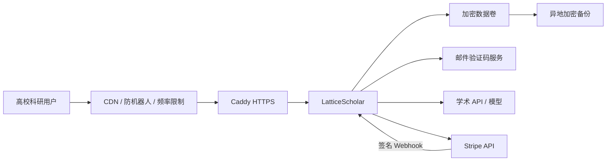

# 官方托管服务部署方案

## 结论

GitHub 仓库保持公开，官方服务部署独立实例并使用邮箱验证码账号。用户可选择自行部署 Community，也可直接访问官方网址使用 Free / Pro。生产环境通过 Caddy 提供 HTTPS，应用负责账号、配额、管理员赠权和支付状态；SQLite 适合早期单实例验证，规模化后再迁移 PostgreSQL。

## 推荐拓扑

## 模式选择

| `LATTICE_AUTH_MODE` | 用途 | 行为 |
|---|---|---|
| `open` | GitHub Community 默认 | 无登录；全部本地能力；不使用托管配额 |
| `accounts` | 官方网址 | 邮箱验证码；用户数据隔离；Free/Pro/赠权/配额 |
| `shared` | 兼容旧课题组实例 | 单一访问密码；不适合公众多用户服务 |

## 上线步骤

1. 准备 Linux 云服务器。基础服务建议从 2 核、4 GB 内存和 40 GB 磁盘起步；Web 服务不要与本地 7B 模型争抢内存。
2. 准备域名、DNS 和合规手续。中国大陆服务器通常需要 ICP 备案；高校二级域名按学校信息化流程申请。
3. 只开放 80/443；8765、数据库和模型端口不得直接暴露公网。
4. 复制 `.env.production.example` 为 `.env`，填写强随机会话密钥、管理员邮箱和生产 SMTP。
5. 保持 `LATTICE_DEV_AUTH=false`，否则验证码会出现在响应与本地预览日志中。
6. 先设置 `LATTICE_BILLING_ENABLED=false`，完成账号、邮箱、赠权、数据隔离、备份和恢复验证。
7. 启动：`docker compose -f compose.production.yaml up -d --build`。
8. 在 Stripe 创建 recurring Price，填入 Secret Key 与 Price ID；配置 Webhook 到 `/api/billing/webhook/stripe`，订阅 Checkout 与 subscription updated/deleted 事件。
9. 用测试模式完成购买、取消、重复 Webhook、错误签名和账单 Portal 流程，再开启真实支付。

## 邮箱与管理员赠权

- `LATTICE_ADMIN_EMAILS` 接受逗号分隔邮箱；这些邮箱验证登录后成为管理员；
- 管理员侧栏会出现“权益管理”，可按用户邮箱赠送永久或限时 Pro；
- 赠权在用户下次请求时实时判定，不要求重新注册；
- 正式环境建议使用可信 SMTP 事务邮件服务，配置 SPF、DKIM、DMARC 和退信监控；
- 应在反向代理/CDN 增加 IP 与邮箱双维度限频。应用已经实现同邮箱 60 秒发送间隔、验证码 10 分钟过期和最多 5 次尝试，但边缘防护仍然必要。

## Stripe 安全清单

- Secret Key 和 Webhook Secret 只存在服务端环境变量；
- 结账 Session 必须由已登录账号在服务端创建；
- 应用用原始请求体和 `Stripe-Signature` 验签，并实施五分钟时间容差；
- Webhook 按事件 ID 幂等，重复投递不会重复变更权益；
- 订阅取消、过期和付款状态以 Webhook 为准，不相信浏览器跳转参数；
- Customer Portal 只为当前已登录且已有 Stripe Customer 的用户创建；
- 退款、税务、发票和争议处理按实际经营主体配置。

## 数据与隐私

- 当前账号模式已按 `owner_id` 隔离证据库；缓存可共享公开元数据；
- PDF 只在请求内存中解析，不写入证据库；
- 不在日志保存验证码明文、论文正文、支付卡信息或模型 API Key；
- 每日备份数据卷，每月至少进行一次恢复演练；
- 远程模型默认禁止，只有 `LATTICE_ALLOW_REMOTE_LLM=true` 才发送文本；
- 发布隐私政策，明确第三方学术源、邮件服务、模型服务和支付平台的数据流。

## 何时迁移 PostgreSQL

出现以下任一情况时停止扩展单实例 SQLite：多副本部署、持续高并发写入、团队空间/复杂权限、需要可靠审计或需要无停机备份。迁移时保持用户、赠权、订阅、用量和 Webhook 事件的唯一约束与事务语义。

## 上线验收

- 未登录 API 返回 401，健康检查保持公开；
- 普通用户看不到管理员入口，直接调用管理员 API 返回 403；
- Free 超额返回 429，高级能力返回 402；
- 管理员按邮箱赠权后用户立即获得 Pro，撤销后恢复原套餐；
- 两个账号的证据库相互不可见；
- Stripe 正确签名生效、错误/过期签名失败、重复事件只处理一次；
- TLS、安全响应头、备份、恢复、监控和告警全部完成；
- 用户协议、隐私政策、取消/退款、合理使用、版权与学术诚信说明可见。

域名、云服务器、SMTP 与收款账户属于外部资源，仓库不会虚构一个“已经可用”的公网网址。获得这些资源后，项目代码已具备早期受控公测所需的主要应用层能力。
