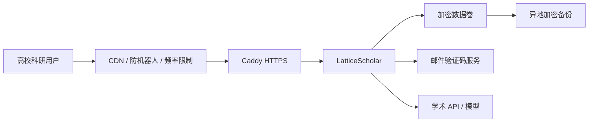

# 托管部署方案

## 结论

GitHub 仓库保持公开，托管服务部署独立实例并使用邮箱验证码账号。用户可选择自行部署，也可直接访问托管网址。生产环境通过 Caddy 提供 HTTPS；SQLite 适合早期单实例验证，规模化后再迁移 PostgreSQL。

## 推荐拓扑

## 模式选择

| `LATTICE_AUTH_MODE` | 用途 | 行为 |
|---|---|---|
| `open` | 自托管默认 | 无登录；全部本地能力 |
| `accounts` | 推荐 | 邮箱验证码；用户数据隔离；管理员/普通用户 |
| `shared` | 兼容旧课题组实例 | 单一访问密码 |

## 上线步骤

1. 准备 Linux 云服务器。基础服务建议从 2 核、4 GB 内存和 40 GB 磁盘起步。
2. 准备域名、DNS 和合规手续。中国大陆服务器通常需要 ICP 备案。
3. 只开放 80/443；8765、数据库和模型端口不得直接暴露公网。
4. 复制 `.env.production.example` 为 `.env`，填写强随机会话密钥、管理员邮箱和生产 SMTP。
5. 生产环境必须配置 SMTP，否则验证码会显示在页面上（仅适合本地开发）。
6. 完成账号、邮箱、数据隔离、备份和恢复验证。
7. 启动：`docker compose -f compose.production.yaml up -d --build`。

## 邮箱与管理员

- `LATTICE_ADMIN_EMAILS` 接受逗号分隔邮箱；这些邮箱验证登录后成为管理员；
- 管理员侧栏会出现"系统管理"，可核验自动发现的政策候选；
- 所有功能对所有登录用户免费开放，无使用限制；
- 正式环境建议使用可信 SMTP 事务邮件服务，配置 SPF、DKIM、DMARC 和退信监控；
- 应在反向代理/CDN 增加 IP 与邮箱双维度限频。应用已经实现同邮箱 60 秒发送间隔、验证码 10 分钟过期和最多 5 次尝试，但边缘防护仍然必要。

## 数据与隐私

- 当前账号模式已按 `owner_id` 隔离证据库；缓存可共享公开元数据；
- PDF 只在请求内存中解析，不写入证据库；
- 不在日志保存验证码明文、论文正文或模型 API Key；
- 每日备份数据卷，每月至少进行一次恢复演练；
- 远程模型默认禁止，只有 `LATTICE_ALLOW_REMOTE_LLM=true` 才发送文本；
- 发布隐私政策，明确第三方学术源、邮件服务和模型服务的数据流。

## 何时迁移 PostgreSQL

出现以下任一情况时停止扩展单实例 SQLite：多副本部署、持续高并发写入、团队空间/复杂权限、需要可靠审计或需要无停机备份。

## 上线验收

- 未登录 API 返回 401，健康检查保持公开；
- 普通用户看不到管理员入口，直接调用管理员 API 返回 403；
- 两个账号的证据库相互不可见；
- TLS、安全响应头、备份、恢复、监控和告警全部完成；
- 隐私政策、合理使用、版权与学术诚信说明可见。

域名、云服务器、SMTP 属于外部资源，仓库不会虚构一个"已经可用"的公网网址。获得这些资源后，项目代码已具备部署所需的主要应用层能力。
